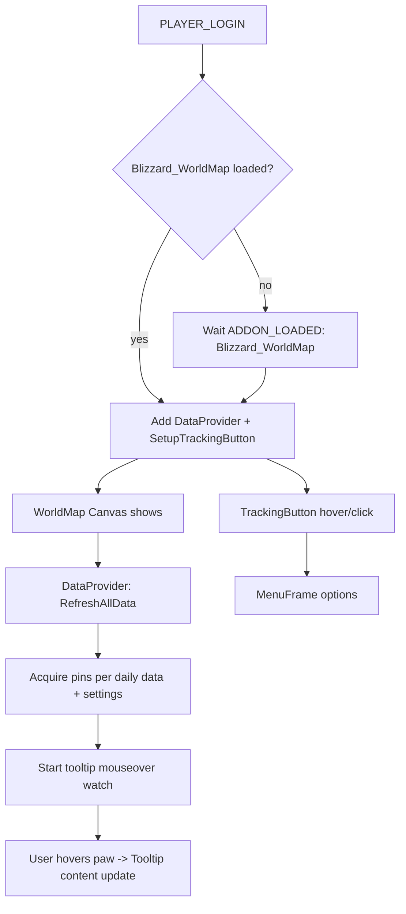

# Battle Pet Daily Tamer — Developer Documentation

This document explains the internal architecture and flow of the addon as currently rolled back to the stable, pre-refactor state. It synthesizes the developer-facing comments embedded across the codebase.

- Repository path: `World of Warcraft/_classic_/Interface/AddOns/Battle Pet Daily Tamer/`
- SavedVariables: `BattlePetDailyTamerSettings`
- Primary namespace frame: `BattlePetDailyTamer` (defined in `Frames.xml`)
- CVAR toggle: `showTamers` (global enable/disable of tamers display)

Sections:
- Overview and runtime flow
- UI frames and templates
- Data model
- Map provider and pin lifecycle
- Tooltip system
- Options menu and tracking button
- Settings and CVARs
- World/Azeroth mapping special cases
- Performance notes and taint safety
- Extending data and features
- Troubleshooting for developers

## Overview and Runtime Flow

- The addon anchors itself via the root frame `BattlePetDailyTamer` declared in `Frames.xml`. This frame serves as the namespace and central event dispatcher.
- Initialization occurs in `Main.lua`:
  - `tamer:PLAYER_LOGIN()` initializes `BattlePetDailyTamerSettings` and registers the Map Data Provider and the tracking button if `Blizzard_WorldMap` is loaded. Otherwise it waits for `ADDON_LOADED` to add them.
- The Map Data Provider (`BattlePetDailyTamerDataProviderMixin`) in `Map.lua` owns the lifecycle for paw pins: on map change/refresh it clears pins and repopulates according to data plus settings.
- Paws are clickable map pins (`BattlePetDailyTamerPinTemplate`), with tooltip support handled in `Tooltip.lua`. A custom tooltip frame (`MapTooltip`) floats beside the mouse cursor while hovering over paw pins.
- A slide-out custom tracking button and menu are defined in `Frames.xml` and implemented in `Options.lua`.

Mermaid flow of the high-level lifecycle:

## UI Frames and Templates

Defined in `Frames.xml`:

- `BattlePetDailyTamerBackdropTemplate`: common backdrop template via `BackdropTemplate`. Uses constants from `Constants.lua`:
  - `BATTLEPETDAILYTAMER_BACKDROP_STYLE`
  - `BATTLEPETDAILYTAMER_BACKDROP_COLOR`
  - `BATTLEPETDAILYTAMER_BORDER_BACKGROUND_COLOR`

- `BattlePetDailyTamer` (root frame/namespace):
  - Children:
    - `MapTooltip`: custom tooltip attached to the world map hover loop.
    - `ScanTooltip`: `GameTooltip` used for programmatic tooltip scans to retrieve localized NPC and quest names.
    - `TrackingButton`: slide-out button cloning the map’s tracking UX pattern.
    - `MenuFrame`: world map overlay menu for toggling categories and settings.

- `BattlePetDailyTamerPinTemplate`: the map pin template used by the data provider.
- `BattlePetDailyTamerMenuItemTemplate`: used to build the menu item list.

The tracking button defines `SlideOut` and `SlideIn` animation groups that call `BattlePetDailyTamer:AnchorTrackingButton("TOP"|"BOTTOM")` to maintain coherent layout during animation.

## Data Model

Defined in `Data.lua` and used throughout:

- `tamer.pawInfo`: Describes the tracked daily types and the mapping to settings keys and display colors/order. Indexed by daily type:
  - 1 = Reward Dailies (green)
  - 2 = Normal Dailies (blue)
  - 3 = Legendary/Beasts of Fable (orange)
  - 4 = World Quests (if/when supported on the specific client)

- `tamer.dailyInfo`: The master table keyed by questID. Each entry contains:
  - `[1] npcID or non-numeric sentinel`
  - `[2] auxiliary label (e.g., “Beasts of Fable III”) shown if present and distinct from name
  - `[3] parent map grouping ID (used with `tamer.parentMapIDs` and `azerothTransforms`) 
  - `[4] instanceID (from UnitPosition)`
  - `[5], [6] world-space coordinates (y, x from UnitPosition returns; note the reversed order is intentional)
  - `[7], [8], [9] back-up zoneMapID and normalized map coords (x,y) for fallbacks
  - `[10] reward/daily type (index into `pawInfo`) determining color/icon and settings
  - `[11] optional pet level to show
  - `[12], [13], [14] speciesIDs for the three pets displayed as icons on the tooltip

- Grouping and lookup tables:
  - `tamer.parentMapIDs`: mapIDs considered “continent groupings”.
  - `tamer.badParentMapIDs`: mapIDs to exclude or that need special handling (no valid parent, etc.).
  - `tamer.questIDsByParentMapID`: questIDs grouped by parent map.
  - `tamer.questIDsWithObjectives`: for Beasts of Fable, etc., to track incomplete objectives.
  - `tamer.azerothTransforms`: matrix transforms to map world positions to Azeroth map coordinates.

## Map Provider and Pin Lifecycle

In `Map.lua`:

- `BattlePetDailyTamerDataProviderMixin = CreateFromMixins(MapCanvasDataProviderMixin)`

Important hooks:

- `tamer.dataProvider:RefreshAllData()`:
  - Hides `MapTooltip` and removes all pins via `RemoveAllData()`.
  - If `showTamers` CVAR is disabled, returns early.
  - Determines `mapID` and `parentMapID`. For Pandaria maps and Azeroth, calls `tamer:UpdateIncompleteObjectives()`.
  - For `parentMapID`s that have quests:
    - Iterates `tamer.questIDsByParentMapID[parentMapID]`.
    - Filters by settings: `BattlePetDailyTamerSettings[tamer.pawInfo[info[10]][2]]`.
    - Calls `tamer:QuestNeedsShown(questID)` to decide visibility.
    - Computes map position as follows:
      - Preferred: `C_Map.GetMapPosFromWorldPos(info[4], worldPos, mapID)`.
      - Fallback: convert from stored zone map coords to world, then back to current map.
      - Final fallback: if currently on the exact zone map, use the zone coords directly.
    - Adds pin with `self:GetMap():AcquirePin("BattlePetDailyTamerPinTemplate", questID, x, y, isInactive)`.
  - Special handling on Azeroth map (mapID 947): only active quests are shown when `BattlePetDailyTamerSettings.OnAzerothMap` is true. Coordinates derived via `tamer:GetAzerothMapPos()` with `azerothTransforms`.

- `RemoveAllData()` clears all `BattlePetDailyTamerPinTemplate` pins and resets `tamer.pawsOnMap`.

- `OnShow()` and `OnHide()` start/stop the tooltip mouseover watcher and clear `tamer.pawsOnMap`.

Pin mixin:

- `BattlePetDailyTamerPinMixin`:
  - `OnAcquired(questID, x, y, isInactive)`: Sets position, selects correct paw icon and vertex color based on `tamer.pawInfo[info[10]]`. Greys out inactive.

Quest filtering:

- `tamer:QuestNeedsShown(questID)`:
  - Returns true for always-visible (e.g., Argus instance ID 1669).
  - For world quests (type 4), verifies it is up (`C_TaskQuest.GetQuestTimeLeftMinutes(questID) > 0`), not at zone-level map, and not completed.
  - For string questIDs (objective-based like “32869:1”, “Alliance:32604”), checks presence in log and incomplete objectives.
  - For numeric questIDs, excludes if completed (`C_QuestLog.IsQuestFlaggedCompleted(questID)`).

## Tooltip System

In `Tooltip.lua`:

- The custom tooltip frame `tamer.MapTooltip` is shown/hidden based on mouseover of paw pins. Unlike traditional `OnEnter/OnLeave` handlers, the addon uses a polling approach to:
  - Allow multiple overlapping paws to contribute to a single tooltip.
  - Avoid conflicts with other addons intercepting mouse events.

- `tamer:StartWatchingForTooltip()` / `StopWatchingForTooltip()`:
  - Attaches/detaches `OnUpdate` to poll for mouseover using `MouseIsOver(paw)` across `tamer.pawsOnMap`.

- `tamer:UpdateTooltip()`:
  - Tracks `questIDsUnderMouse` and builds lines via `tamer:AddLineToTooltip(text)`.
  - Each quest block shows:
    - Tamer name (from NPC ID or quest name).
    - Sub-name (quest name or the secondary detail from `dailyInfo[2]`).
    - If type 4 (world quest), time remaining with color coding.
    - Optional developer debug output: questID.
    - Pet type icons derived by speciesID via `tamer:GetPetsAsText(...)`.

- Name resolution:
  - NPC names: via an invisible tooltip scan using `BattlePetDailyTamerScanTooltip` with a `unit:Creature-...` hyperlink. Reads `BattlePetDailyTamerScanTooltipTextLeft1` for the name.
  - Quest names: tries `C_TaskQuest.GetQuestInfoByQuestID(questID)` for world quests. Otherwise scans tooltip with `quest:<id>` hyperlink.

- Positioning:
  - `tamer:PositionTooltipAtMouse()` anchors `MapTooltip` relative to the cursor with appropriate scaling.

## Options Menu and Tracking Button

In `Options.lua`:

- `tamer:SetupTrackingButton()`:
  - Finds the (anonymous) Blizzard default tracking button by searching `WorldMapFrame` children for a known texture.
  - If found, hooks its `OnEnter` (to slide out the custom `TrackingButton`), `OnHide` (to hide ours), and `OnClick` (hides our menu).
  - If not found (common in MoP Classic), uses a fallback anchor (top-right of the map) and keeps our button visible.

- `tamer:AnchorTrackingButton(relativePoint)`:
  - Anchors our button relative to the default tracking button (when present) or to a fallback.

- `tamer:ShowTrackingButton()` / `tamer:HideTrackingButton()`:
  - Controls the slide-in/out animations and immediate-hide logic on edge cases.

- Menu building and updates:
  - `tamer:SetupMenu()` creates `MenuFrame.Buttons` using `BattlePetDailyTamerMenuItemTemplate`.
  - The header row (id 0) toggles `showTamers` CVAR; subsequent rows map to `tamer.pawInfo[i][2]` keys in `BattlePetDailyTamerSettings`.
  - `tamer:UpdateMenu()` sets check states, enables/disables items based on the main toggle, and updates icon colors/desaturation.

- Input handling:
  - `MenuFrame:OnKeyDown` handles ESC/menu toggle and sets keyboard input propagation.
  - `MenuFrame:OnUpdate` handles hover timer-based auto-hide (after 2 seconds out of hover, unless never hovered).

## Settings and CVARs

- SavedVariables in `Main.lua`:
  - On login, initializes `BattlePetDailyTamerSettings` and fills defaults from `tamer.pawInfo` if missing.

- CVAR `showTamers`:
  - Global master toggle for visibility. The menu header toggles this CVAR.
  - `tamer.dataProvider:RefreshAllData()` returns early if disabled.

- Primary settings keys (stored under `BattlePetDailyTamerSettings`):
  - `TrackSatchels`, `TrackNonSatchels`, `TrackFables`, `TrackWorldQuests`
  - `TrackCompleted`
  - `OnAzerothMap`
  - `LargerPaws`

## World/Azeroth Mapping Special Cases

- When viewing Azeroth (`mapID == 947`):
  - Only active quests are shown, and only when `BattlePetDailyTamerSettings.OnAzerothMap` is true.
  - Coordinates are mapped via `tamer:GetAzerothMapPos(y, x, transforms)` using `tamer.azerothTransforms` with the intentional `(y,x)` order.

- Fallbacks for `C_Map` conversion:
  - If `C_Map.GetMapPosFromWorldPos` returns nil (client differences like MoP Classic), the code:
    - Converts stored zone coords to world with `C_Map.GetWorldPosFromMapPos`, then back to current map.
    - Uses direct zone coords if current map equals `zoneMapID`.

## Performance Notes and Taint Safety

- Tooltip polling avoids attaching dozens of `OnEnter/OnLeave` handlers and allows merged tooltips for overlapping pins.
- Minimizes garbage:
  - Reuses `Vector2D` instances (`CreateVector2D`).
  - Uses string-level checks for objective-style questIDs instead of building transient tables.
- Taint prevention:
  - The menu is a custom full-screen dialog frame with its own templates; avoids default dropdown taint.
  - Keyboard propagation is carefully managed.

## Extending Data and Features

- Adding a new daily:
  - Update `tamer.dailyInfo` with a new questID entry:
    - Include `npcID`, `instanceID`, `world y/x`, `zoneMapID`+map coords as fallback, `daily type`, `level`, `speciesIDs`.
  - Add the questID to `tamer.questIDsByParentMapID[parentMapID]`.
  - Ensure `parentMapIDs[parentMapID]` is set if a new continent/map group is introduced.
  - If it’s a world quest (type 4), ensure its behavior is correct on Azeroth and zone-level maps.

- Adding a new category:
  - Update `tamer.pawInfo` to add the new type entry (order-sensitive).
  - Ensure all `dailyInfo` rows use the correct `[10]` type value.
  - Add a user-facing string/icon and color tuple for the new type.

- Icons and assets:
  - Map pin texture paths are set in pin acquisition (`self.Texture:SetTexture(pawInfo[4])`), and the default paw image path is in `Frames.xml` for the template.

## Troubleshooting for Developers

- Pins not appearing:
  - Verify `showTamers` CVAR and category settings.
  - Confirm `tamer:GetParentMapID(mapID)` returns a valid group.
  - Ensure `dailyInfo` entries have valid `instanceID` and world coords, or that zone fallback coordinates exist.
  - Check `QuestNeedsShown` logic; world quests require a positive `timeLeft` and not being on the zone-level map.

- Tooltip shows “Retrieving Data”:
  - Name scan may be pending. Ensure `ScanTooltip` is defined and not interfered with by other addons.
  - NPC and quest ID formatting in hyperlinks must match the expected formats:
    - NPC: `unit:Creature-0-0-0-0-<npcID>-0000000000`
    - Quest: `quest:<questID>`

- Button missing in MoP Classic:
  - The fallback anchor places the button at map top-right. Adjust offsets in `Options.lua` `AnchorTrackingButton()` if needed.
  - The button always shows in fallback mode and does not auto-hide based on default button hover (by design).

---

This documentation reflects the stable, pre-refactor code layout. Refer to:
- `Main.lua` for initialization and saved variables
- `Frames.xml` for frame definitions, templates, and animations
- `Map.lua` for data provider and pin lifecycle
- `Tooltip.lua` for tooltip polling and content
- `Options.lua` for tracking button/menu logic
- `Data.lua` for all daily data and grouping
- `Constants.lua` for frame visuals and color styles
